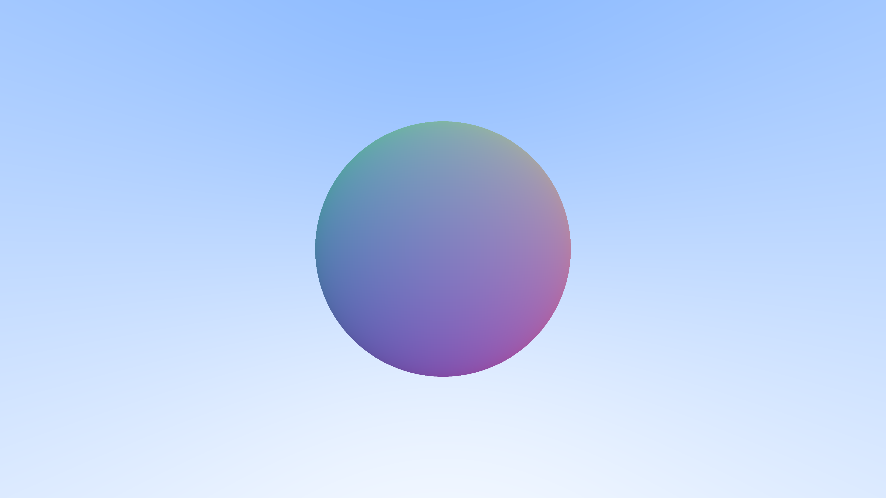
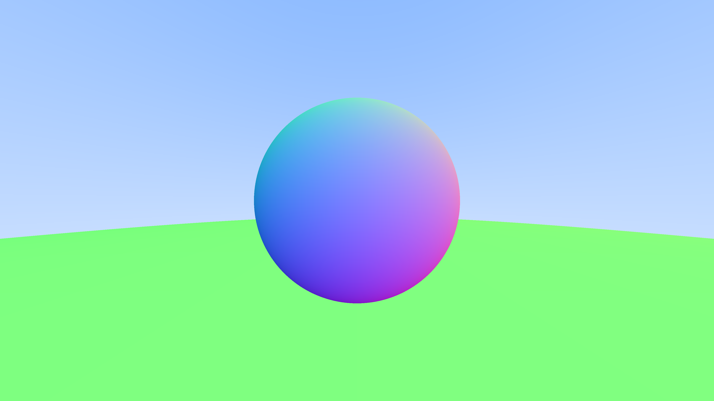
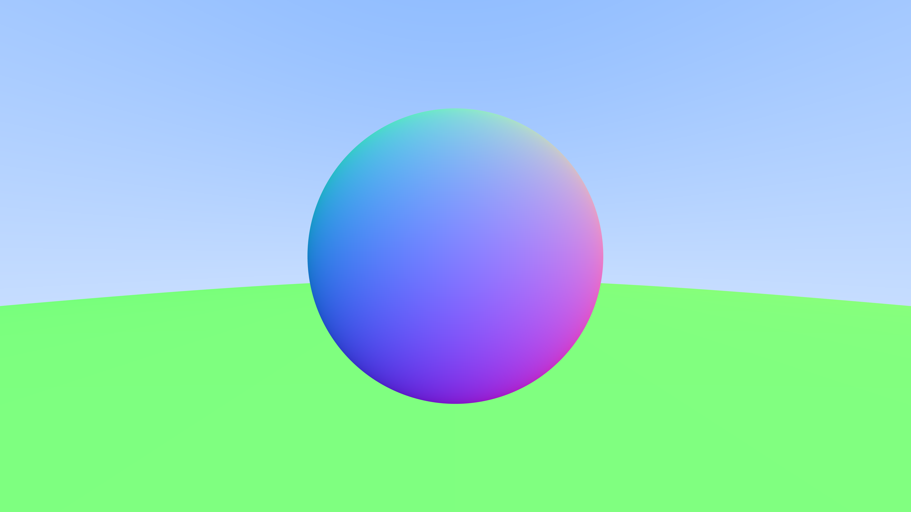
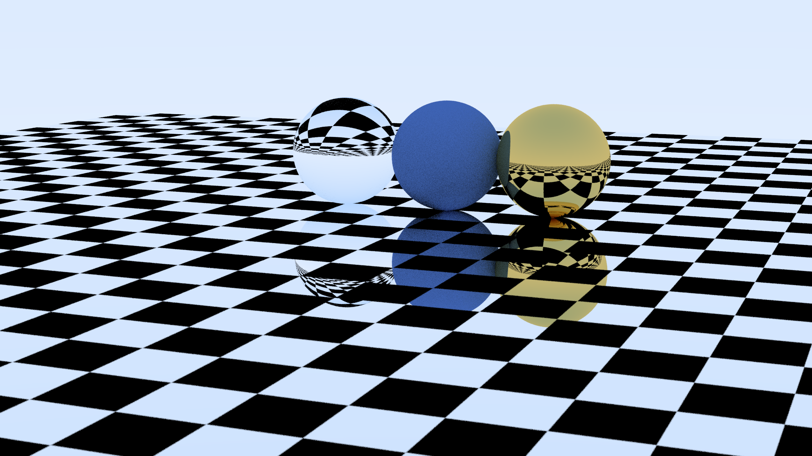

# raytracing1weekend

My implementation of Peter Shirley's ray tracing tutorial, ["Ray Tracing in One Weekend"](https://raytracing.github.io/books/RayTracingInOneWeekend.html) in Go.

## Progress

1. Background with a blue to white linear gradient

2. The first shape: a sphere

3. Implementing shading based on surface normals

4. Antialiasing

5. Diffuse Materials

6. True Lambertian Reflection

7. Metal material

8. Metal Fuzziness

9. Glass material - 1

10. Glass material - 2

11. Positionable Camera

12. Defocus Blur

13. Final Render

14. Animated Render

15. Smooth Circular Motion

16. Triangles

17. Rectangles

18. Chess Board

